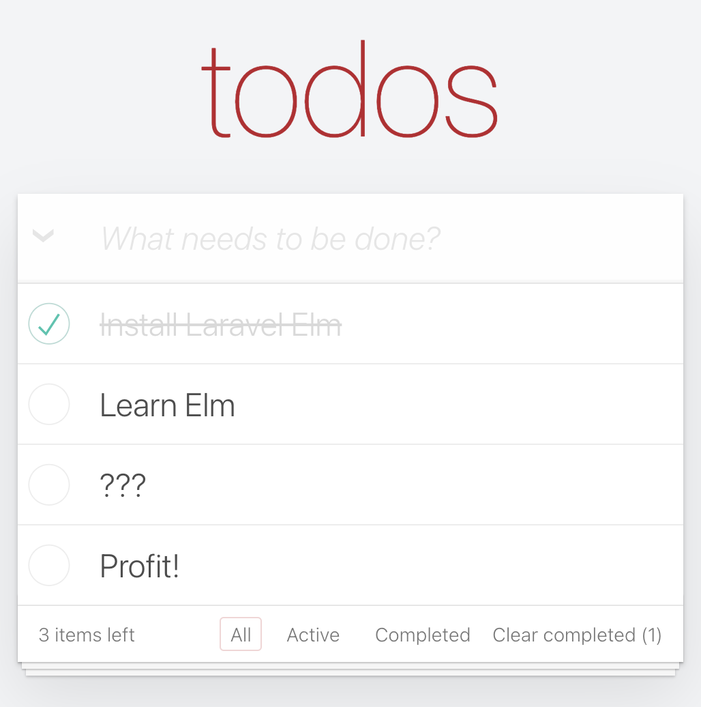

# TodoMVC in Laravel Elm

A complete TodoMVC implementation built with Laravel Elm - showcasing a real-world Laravel Elm application with authentication, CRUD operations, and a beautiful UI.



## Features

- ✅ **Complete TodoMVC Implementation**: All TodoMVC features implemented
- 🔐 **Laravel Authentication**: Full user registration, login, password reset
- 🎨 **Modern UI**: Clean, responsive design with Tailwind CSS
- 🚀 **Laravel 12 + PHP 8.4**: Built on the latest Laravel and PHP
- ⚡ **Vite Build System**: Fast development and optimized production builds
- 🔄 **Real-time Updates**: Seamless SPA experience with Laravel Elm
- 📱 **Responsive Design**: Works perfectly on desktop and mobile

## Tech Stack

- **Backend**: Laravel 12.x, PHP 8.4+
- **Frontend**: Elm 0.19.1, Laravel Elm v5.0
- **Build**: Vite 7.x with Laravel Elm plugin
- **CSS**: Tailwind CSS v4
- **Database**: SQLite (easily configurable)

## TodoMVC Features

- ✨ Add new todos
- ✅ Toggle todo completion 
- ✏️ Edit todos inline (double-click)
- 🗑️ Delete individual todos
- 📋 Filter by All/Active/Completed
- 🔄 Toggle all todos at once
- 🧹 Clear completed todos
- 📊 Items counter

## Quick Start

### Prerequisites

- PHP 8.4+
- Node.js 18+
- Composer
- npm/yarn

### Installation

1. **Clone the repository**
   ```bash
   git clone https://github.com/loganhenson/laravel-elm-todomvc.git
   cd laravel-elm-todomvc
   ```

2. **Install PHP dependencies**
   ```bash
   composer install
   ```

3. **Install Node dependencies**
   ```bash
   npm install
   ```

4. **Set up environment**
   ```bash
   cp .env.example .env
   php artisan key:generate
   ```

5. **Set up database**
   ```bash
   php artisan migrate
   ```

6. **Build frontend assets**
   ```bash
   npm run build
   ```

7. **Start the development server**
   ```bash
   php artisan serve
   ```

Visit `http://localhost:8000` in your browser!

## Development

For development with hot reloading:

```bash
npm run dev
```

This will start Vite's development server with:
- ⚡ Hot Module Replacement (HMR)
- 🔄 Elm compilation on file changes
- 🎨 Tailwind CSS processing
- 🐛 Debug mode with Laravel Elm DevTools support

## Project Structure

```
├── app/
│   ├── Http/Controllers/
│   │   └── TodosController.php    # Todo CRUD operations
│   ├── Models/
│   │   ├── Todo.php               # Todo model
│   │   └── User.php               # User model with todos relationship
│   └── Policies/
│       └── TodoPolicy.php         # Authorization policies
├── resources/
│   ├── elm/
│   │   ├── pages/
│   │   │   └── Todos.elm          # Main TodoMVC Elm application
│   │   └── laravel-elm-stuff/
│   │       └── Routes.elm         # Generated Laravel routes for Elm
│   ├── js/
│   │   └── elm.js                 # Elm entry point
│   └── views/
│       └── app.blade.php          # Main application layout
├── routes/
│   └── web.php                    # Laravel routes
└── vite.config.js                 # Vite configuration with Laravel Elm
```

## Key Laravel Elm Concepts Demonstrated

### 1. **Props and State Management**
```elm
type alias Props =
    { todos : List Todo
    , errors : Errors
    }

type alias State = 
    { newTodo : String
    , filter : Filter
    , editingTodo : Maybe Int
    , editText : String
    }
```

### 2. **Server Communication**
```elm
-- Create new todo
Routes.post
    (Encode.object
        [ ( "url", Encode.string Routes.todos )
        , ( "data", Encode.object [ ( "text", Encode.string newTodoText ) ] )
        ]
    )
```

### 3. **Authentication Integration**
All routes are protected with Laravel's `auth` middleware, and todos are automatically scoped to the authenticated user.

### 4. **Real-time Updates**
Changes are immediately reflected in the UI through Laravel Elm's seamless page updates.

## Database Schema

```sql
-- todos table
id          BIGINT PRIMARY KEY
user_id     BIGINT FOREIGN KEY → users.id
text        VARCHAR(255) NOT NULL
completed   BOOLEAN DEFAULT FALSE
created_at  TIMESTAMP
updated_at  TIMESTAMP
```

## API Endpoints

| Method | Endpoint | Description |
|--------|----------|-------------|
| GET | `/todos` | List user's todos |
| POST | `/todos` | Create new todo |
| PATCH | `/todos/{todo}` | Update todo |
| DELETE | `/todos/{todo}` | Delete todo |
| POST | `/todos/toggle-all` | Toggle all todos |
| DELETE | `/todos/clear-completed` | Clear completed todos |

## Testing

Run the test suite:

```bash
php artisan test
```

## Production Deployment

1. **Build for production**
   ```bash
   npm run build
   ```

2. **Configure environment**
   ```bash
   php artisan config:cache
   php artisan route:cache
   php artisan view:cache
   ```

3. **Set up your production database and run migrations**
   ```bash
   php artisan migrate --force
   ```

## Contributing

1. Fork the repository
2. Create your feature branch (`git checkout -b feature/amazing-feature`)
3. Commit your changes (`git commit -m 'Add amazing feature'`)
4. Push to the branch (`git push origin feature/amazing-feature`)
5. Open a Pull Request

## Learn More

- **Laravel Elm Documentation**: [Laravel Elm Guide](https://github.com/tightenco/laravel-elm)
- **TodoMVC Project**: [TodoMVC.com](http://todomvc.com/)
- **Elm Guide**: [guide.elm-lang.org](https://guide.elm-lang.org/)
- **Laravel Documentation**: [laravel.com/docs](https://laravel.com/docs)

## License

This project is open-sourced software licensed under the [MIT license](LICENSE).